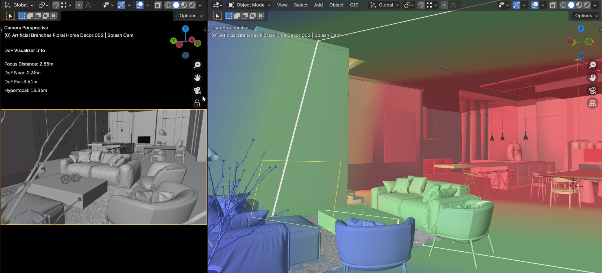
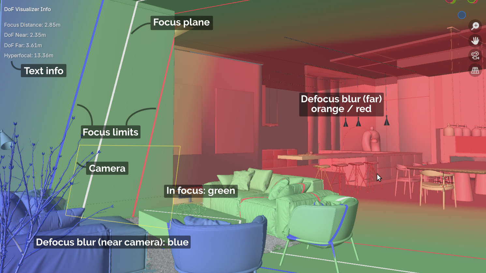
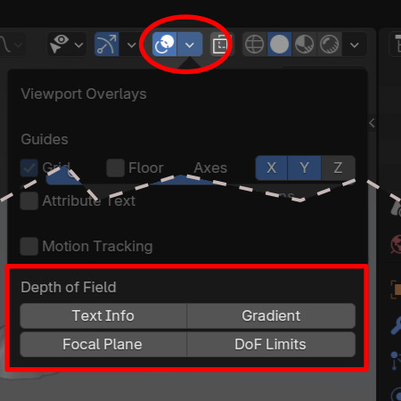
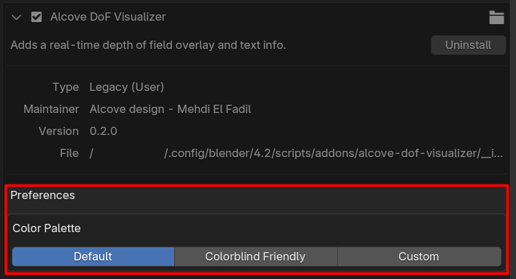
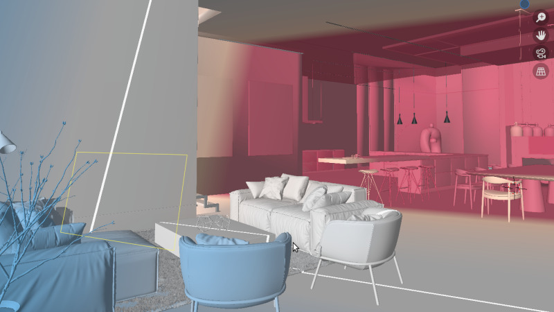

# Alcove DoF Visualizer

A Blender addon that provides real-time depth of field visualization in the 3D viewport. Helps cinematographers and photographers visualize focus zones, hyperfocal distances, and DoF limits directly in their scene.

## Contents

* [Features](#features)
* [Installation](#installation)
* [Usage](#usage)

## Features

Preview depth of field effects _from any viewing angle_, making it easier to compose and adjust your shots.

- Real-time DoF gradient overlays
- Focus plane laser indicator
- Near/far DoF limit visualization
- Hyperfocal distance calculations
- Live text info display
- Works with focus objects and manual focus distance

## Installation

### 1. Download the addon

In the [Releases](/alcove-design/alcove-dof-visualizer/releases) section of this repository, download the latest **zip file**.

The releases are named using the format: `alcove-dof-visualizer-vX.Y.Z`.

### 2. Install the addon in blender

1. **Do not extract** the ZIP file - install it as-is.
2. Open **Blender**.
3. Go to **Edit > Preferences > Add-ons**.
4. Click the **Install...** button at the top right.
5. In the file browser, select the ZIP file you downloaded and click **Install Add-on**.
6. After installation, search for the addon in the list and enable it by checking the box next to its name.

N.B. This addon relies on `numpy` python module, which should already be included in blender's python environment, so no extra install is needed.

## Usage

The DoF visualizer provides a handful of overlay options showing depth of field information for the active camera.

Four visualizations can be turned on and off in any combination to suit your needs. The visualizations will update in real-time as you adjust your camera's DoF settings or move the camera and focus object.

### Toggle the overlays

Open the **Viewport Overlays** menu in the viewport header (top-right) and enable the desired options:

* **Text Info**: Displays technical information about the DoF settings, such as focus distance, f-stop, hyperfocal distance, and the near/far limits of the depth of field.
* **Gradient**: Shows a color gradient overlay that visualizes the depth of field. The in-focus area is clear, while out-of-focus areas are tinted.
* **Focal Plane**: Displays a "laser ray" band that indicates the exact point of focus.
* **DoF Limits**: Shows two bands that mark the near and far limits of the depth of field.

### Customize

Toggle between preset color palettes or choose your own colors in the addon's preferences menu.

Defocus blur gradient overlay with the colorblind-friendly palette looks as below:

## Limitations

The following limitations may be addressed in future updates:

* The DoF overlays only render on front-facing surfaces. Objects with flipped normals or incorrect face orientation won't display the color visualization.
* The overlays only work on mesh objects, not on particles, curves or text.
* The overlays update in real-time when editing the scene (changing camera settings, moving/transforming objects). However, when an object is modified in Edit Mode, the DoF visualization won't update on the changed geometry until you save and reopen the blend file.

## Credits

This README file uses the interior design scene from [Blender 4.1 splash screen](https://www.blender.org/download/demo-files/#splash), created by Lynxsdesign and released under a Creative Commons Attribution (CC BY) license.
